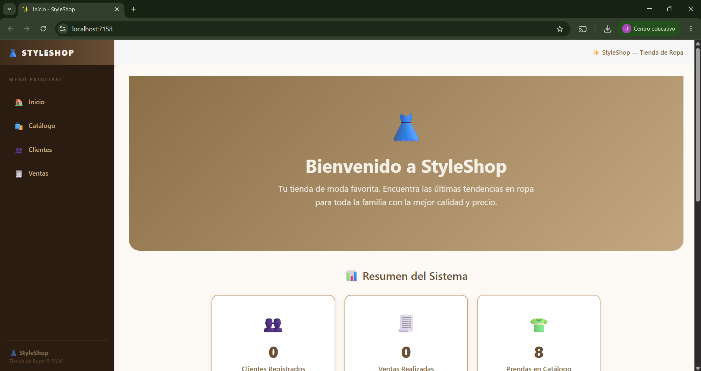
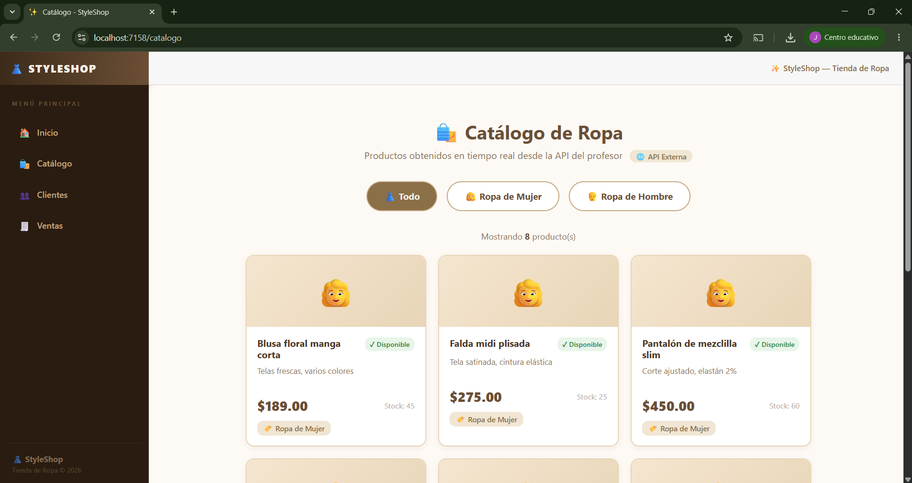
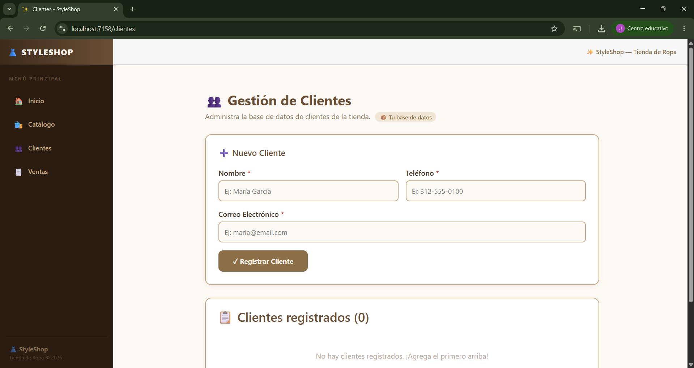
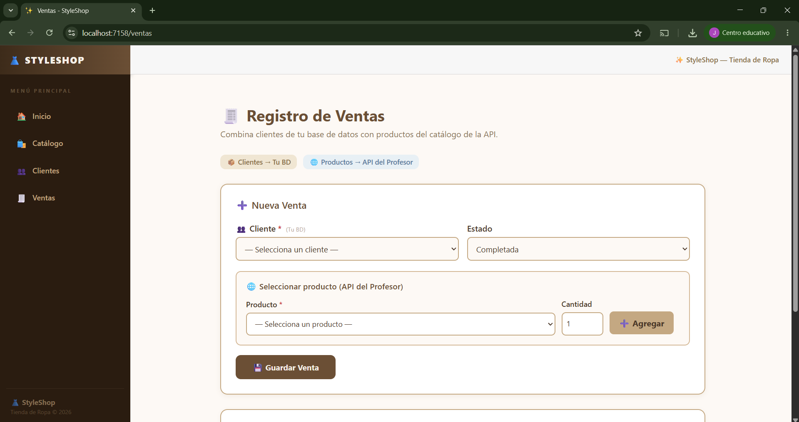

# 👗 StyleShop — Tienda de Ropa


---

## 👤 Información del Estudiante

| Campo | Dato |
|-------|------|
| **Nombre completo** | Julio César Gómez Frausto |
| **Número de cuenta** | 20219473 |
| **Negocio asignado** | Tienda de Ropa |
| **Materia** | Programación para Web |
| **Docente** | Ing. Ricardo Jaramillo Velasco |

---

## 🌐 API Consumida

**API del Profesor — Comercio**

| Campo | Valor |
|-------|-------|
| **URL base** | `https://api-udec-pweb-aedec9hxbugye0am.westus3-01.azurewebsites.net` |
| **Swagger** | `https://api-udec-pweb-aedec9hxbugye0am.westus3-01.azurewebsites.net/swagger/index.html` |
| **Endpoint 1** | `GET /api/comercio/productos/categoria/1` — Ropa de Mujer |
| **Endpoint 2** | `GET /api/comercio/productos/categoria/2` — Ropa de Hombre |

---

## 🗄️ Base de Datos Propia (Azure SQL)

Tablas creadas con Entity Framework Core y desplegadas en Azure SQL Database:

| Tabla | Descripción |
|-------|-------------|
| `Clientes` | Registro de clientes de la tienda (CRUD completo) |
| `Ventas` | Registro de ventas realizadas |
| `DetallesVenta` | Detalle de cada venta, vincula con productos de la API |

### Relaciones
- **Clientes → Ventas:** Uno a muchos
- **Ventas → DetallesVenta:** Uno a muchos
- `DetallesVenta.ProductoApiId` referencia el `Id` del producto de la API (sin duplicar datos maestros)

---

## 📄 Pantallas del Sistema

### 🏠 Pantalla 1 — Inicio / Dashboard
> Indicadores en tiempo real: clientes y ventas de la BD propia, prendas y categorías de la API.



---

### 🛍️ Pantalla 2 — Catálogo de Ropa
> Productos consumidos desde la API del profesor. Filtro por categoría: Ropa de Mujer y Ropa de Hombre.



---

### 👥 Pantalla 3 — Gestión de Clientes
> CRUD completo: alta, consulta, edición y eliminación de clientes con validaciones.



---

### 🧾 Pantalla 4 — Registro de Ventas
> Integración: clientes de la BD propia + productos de la API del profesor en una sola operación.



---

## 🚀 Cómo Ejecutar el Proyecto

```bash
# 1. Clonar el repositorio
git clone https://github.com/TU_USUARIO/TiendaRopa.git
cd TiendaRopa

# 2. Configurar la cadena de conexión en appsettings.json

# 3. Aplicar migraciones
Add-Migration InitialCreate
Update-Database

# 4. Ejecutar
dotnet run
```

---

## 🛠️ Tecnologías Utilizadas

- **Blazor Server** (.NET 10) — Framework principal
- **Entity Framework Core 10** — Acceso a base de datos
- **Azure SQL Database** — Base de datos en la nube
- **HttpClient + GetFromJsonAsync** — Consumo de API REST
- **Git + GitHub** — Control de versiones y repositorio

---

## 🤖 Declaratoria de IA

Este proyecto fue desarrollado con apoyo de **Claude (Anthropic)** como herramienta de asistencia en la generación de componentes Blazor, diseño visual con paleta beige y patrones de consumo de API.

**Enlace de conversación:** [Agregar enlace aquí]

Comprendo completamente el funcionamiento de cada módulo y estoy preparado para defenderlo oralmente.